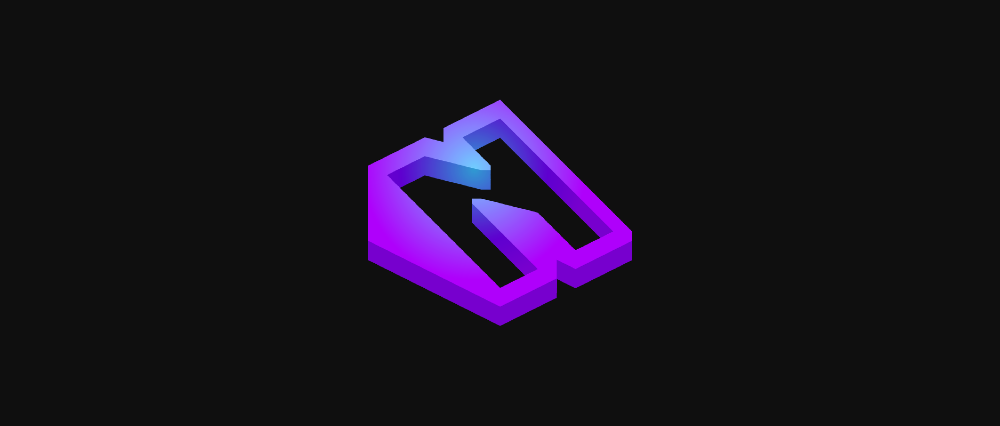

  

Noxify is a Discord bot currently under active development by XtroBag and BroBoiler. We're constantly adding new features and refining existing ones to create a versatile and enjoyable experience for your server.

**Key Features:**

* **Economy System:**
    * `account`: View your account balance and details.
    * `economy`: Manage server-wide economy settings.
    * `leaderboard`: See the top earners in the server.
    * `pay`: Pay another user in-game currency.
    * `transaction`: View recent transactions within the economy.
    * `transfer`: Transfer funds between your own accounts.
    * `work`: Earn in-game currency by completing daily tasks.

* **Utility & Fun:**
    * `mcskin`: View Minecraft player skins.
    * `rps`: Play a classic game of Rock-Paper-Scissors.
    * `say`: Make the bot speak in a designated channel.
    * `github`: Access our GitHub repository for the latest updates and source code.
    * `help`: Get a list of available commands and their descriptions.

* **Moderation & Administration:**
    * `channelperms`: Manage permissions for specific channels.
    * `guilds`: View information about the servers Noxify is currently active on.
    * `perms`: Check user permissions within the server.
    * `logging`: Enable/disable the server's logging system for enhanced moderation.
    * `user`: View information about a specific user within the server.

We're constantly striving to improve Noxify and add more exciting features. Stay tuned for updates and join our community to provide feedback and suggestions!
